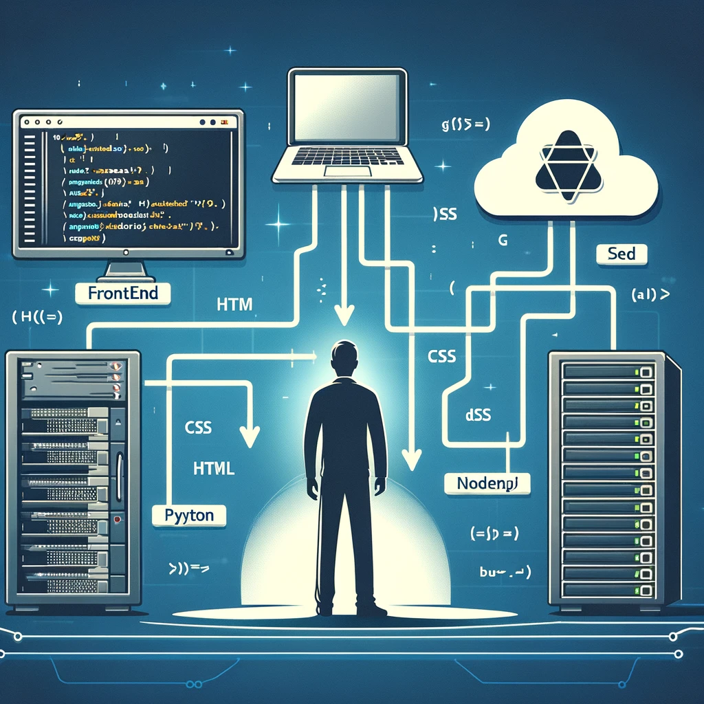
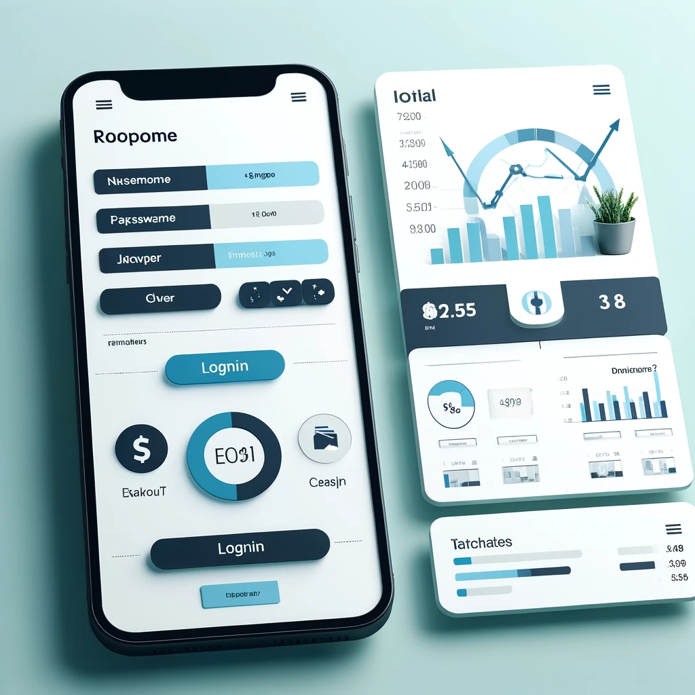

# Fundamentos programador Full Stack

### Introducción:

Este curso está diseñado para ofrecer una experiencia práctica en el desarrollo web full stack, integrando las tecnologías de FastAPI para el backend y React para el frontend. A lo largo de 36 horas, se demostrará cómo estas herramientas pueden facilitar la creación de aplicaciones web modernas, eficientes y funcionales, enfatizando la colaboración a través del pair programming.

### ¿Qué es un programador Full Stack?

Un programador Full Stack es un profesional que tiene conocimientos y habilidades tanto en el desarrollo frontend (la parte visible y con la que interactúa el usuario) como en el desarrollo backend (la lógica del servidor, bases de datos, y la integración de sistemas). Este tipo de desarrollador es capaz de manejar todos los aspectos de la creación de una aplicación web, desde el diseño de la interfaz de usuario hasta la gestión de servidores y bases de datos.

    

#### Algunos conceptos base para ser un programador Full Stack

1. **Arquitectura de Aplicaciones Web:**
   - **Descripción:** Comprender cómo se estructuran las aplicaciones web es esencial. Esto incluye el conocimiento de patrones de arquitectura como MVC (Modelo-Vista-Controlador), Microservicios, y RESTful APIs.
   - **Importancia:** Ayuda a diseñar aplicaciones escalables, mantenibles y fáciles de entender. La correcta arquitectura asegura que el sistema pueda crecer y adaptarse a nuevas funcionalidades sin grandes refactorizaciones.

2. **Control de Versiones y Colaboración:**
   - **Descripción:** Utilizar sistemas de control de versiones como Git es crucial para cualquier proyecto de desarrollo. También es importante saber cómo colaborar efectivamente con otros desarrolladores usando herramientas como GitHub o GitLab.
   - **Importancia:** Permite gestionar cambios en el código de manera segura, facilita la colaboración en equipo y el seguimiento del historial de cambios. Esencial para trabajar en proyectos de cualquier tamaño y complejidad.

3. **Despliegue y DevOps:**
   - **Descripción:** Conocer cómo desplegar y mantener aplicaciones en diferentes entornos (desarrollo, prueba, producción) utilizando herramientas y prácticas de DevOps.
   - **Importancia:** Asegura que las aplicaciones sean desplegadas de manera consistente y fiable. DevOps promueve la automatización de tareas repetitivas y el monitoreo continuo, mejorando la eficiencia y la calidad del software.

4. **Seguridad en Aplicaciones Web:**
   - **Descripción:** Implementar medidas de seguridad para proteger las aplicaciones contra amenazas comunes como inyecciones SQL, cross-site scripting (XSS), y cross-site request forgery (CSRF). También incluye la gestión adecuada de la autenticación y autorización de usuarios.
   - **Importancia:** Protege los datos de los usuarios y la integridad de la aplicación. La seguridad es crítica para ganar y mantener la confianza de los usuarios y cumplir con las regulaciones legales.

5. **Desarrollo de APIs RESTful:**
   - **Descripción:** Crear APIs RESTful bien diseñadas que permitan la comunicación entre el frontend y el backend de la aplicación. Incluye el diseño de endpoints, métodos HTTP (GET, POST, PUT, DELETE) y manejo de errores.
   - **Importancia:** Las APIs RESTful son el estándar para la comunicación entre sistemas en el desarrollo web moderno. Un diseño adecuado facilita la integración y el mantenimiento de las aplicaciones.

6. **Manejo de Estados en el Frontend:**
   - **Descripción:** Comprender cómo manejar el estado de la aplicación en el frontend usando herramientas y librerías como Redux, Context API en React, o Vuex en Vue.js.
   - **Importancia:** El manejo adecuado del estado es crucial para crear aplicaciones reactivas y eficientes. Facilita la gestión de datos y su sincronización con el backend, mejorando la experiencia del usuario.

7. **Herramientas de IA para Desarrollo:**
   - **Descripción:** Utilizar herramientas de inteligencia artificial puede mejorar significativamente la eficiencia del desarrollo, proporcionando ayudas como autocompletado de código, generación de pruebas y documentación.
   - **Fundamentos:** Introducción a herramientas de IA que pueden asistir en el desarrollo de software, y cómo integrarlas en el flujo de trabajo.

**Frameworks o librerías para el curso**

FastAPI es un moderno framework web para Python, conocido por su sencillez y la capacidad de generar documentación automática. React es una biblioteca de JavaScript utilizada para construir interfaces de usuario, famosa por su eficiencia en el manejo de estados y su enfoque en componentes reutilizables.

**Configuración del entorno de desarrollo**

Para el curso vamos a utilizar python, node.js y vscode como editor de texto. Primero vamos a ir con python, si estas usando linux es muy probable que ya tengas python y si tienes windows es recomendable usar la microsoft store pero tambien se puede ir directamente a la pagina de [python](https://www.python.org/) (recuerda darle check a añadir el path a las variables de entorno). En el caso de [node.js](https://nodejs.org/en) se debe ir directamente a la pagina y seguir las indicaciones que estan establecidas. Por último se tiene el [vscode](https://code.visualstudio.com/) que se puede seguir las indicaciones de la página web o si se tiene windows ir a la microsoft store.

**Herramientas de IA para desarrollo:**

Para desarrollar hoy en día se puede utilizar diferentes herramientas como gemini y chatgpt. Aunque tambien existen en hugginface muchos modelos opensource como Llama3 y dependiendo del equipo se puede utilizar algunos utilizando [lmstudio](https://lmstudio.ai/) que es una aplicacion open source estilo chatgpt pero en local.

- [htmlgenerator](https://htmlgenerator.ai/)
- [taskade](https://www.taskade.com/generate/programming/html-code)
- [phind](https://www.phind.com/search?home=true)

#### Aplicación del curso:

En el curso, desarrollaremos una aplicación para llevar registro de los ingresos y egresos de una persona, además de mostrar gráficas de estas transacciones. A continuación se explica el diagrama entidad-relación y las vistas basadas en la imagen proporcionada:

    

**Diagrama Entidad-Relación:**

El diagrama incluye las siguientes entidades y sus relaciones:

- **Transacciones:** id, tipo_id, cuenta_id, categoria_id, descripcion, fecha_transaccion, cantidad.
- **Tipo:** id, name.
- **Cuenta:** id, name, interes, cuota_mensual, fecha_corte, fecha_creacion.
- **Categoria:** id, name.
- **User:** name, password, fecha_creacion.

Las relaciones entre estas entidades permiten un seguimiento detallado de cada transacción, categorizándolas y asociándolas a cuentas y tipos específicos. Los usuarios pueden gestionar sus cuentas y transacciones de manera eficiente.

Claro, aquí tienes las entidades transformadas en tablas utilizando Markdown:

### Transacciones

| Campo              | Tipo       |
|--------------------|------------|
| id                 | int        |
| tipo_id            | int        |
| cuenta_id          | int        |
| categoria_id       | int        |
| descripcion        | varchar    |
| fecha_transaccion  | datetime   |
| cantidad           | decimal    |

### Tipo

| Campo | Tipo    |
|-------|---------|
| id    | int     |
| name  | varchar |

### Cuenta

| Campo         | Tipo     |
|---------------|----------|
| id            | int      |
| name          | varchar  |
| interes       | decimal  |
| cuota_mensual | decimal  |
| fecha_corte   | datetime |
| fecha_creacion| datetime |

### Categoria

| Campo | Tipo    |
|-------|---------|
| id    | int     |
| name  | varchar |

### User

| Campo         | Tipo      |
|---------------|-----------|
| name          | varchar   |
| password      | varchar   |
| fecha_creacion| datetime  |

**Vistas:**

- **Login:** Permite a los usuarios autenticarse en la aplicación utilizando su nombre y contraseña.
- **Vista General (General View):** Ofrece una vista consolidada de las transacciones, filtradas por cuenta. Incluye un tablero (dashboard) con gráficos que muestran los ingresos y egresos, facilitando el análisis financiero.

